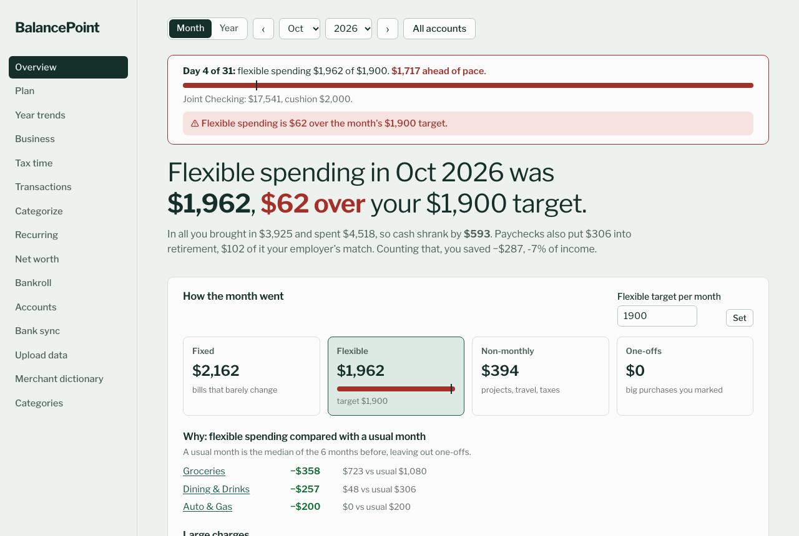
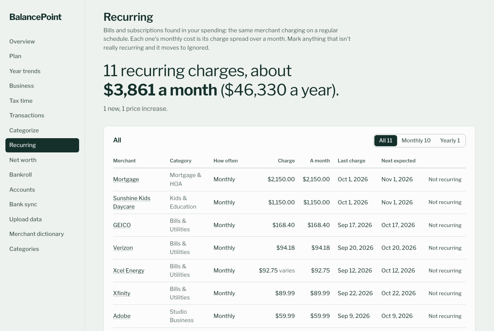

# BalancePoint

A local, Monarch-style budget app. It reads bank CSV exports or syncs banks daily through
SimpleFIN Bridge (and, optionally, imports an old hand-kept budget spreadsheet), cleans up merchant
names with an editable dictionary, auto-categorizes transactions, shows money flow by month and by
year, plans the next 12 months, tracks balances and net worth across accounts (including closed ones),
keeps business accounts' profit apart, and flags transactions for tax time.

Everything runs on your machine. Data lives in `data/`, which git ignores.

**Not technical? Start with [Minimum steps for non-technical users](#minimum-steps-for-non-technical-users).**





*Screenshots show the made-up demo household.*

**What it assumes:** US dollars and English. Bank CSVs work from any bank with a date, a description
and an amount (or debit and credit) column; US Bank exports are understood best (their card memos also
carry the merchant type, used to guess categories). SimpleFIN Bridge covers most US banks, card
companies, brokerages and lenders.

**Optional parts** switch on in `data/personal.toml` under `[features]`: `blackjack` (a Bankroll page
for tracking blackjack sessions; off for new installs, on once there are sessions) and `business` (the
Business page; on once an account has its own categories). See [Optional features](#optional-features).

## Minimum steps for non-technical users

You don't need to know any code. Pick the way that fits you.

### Easiest: someone sets it up, you just use it

Most households have one person who doesn't mind a little setup. They do it once; everyone else only
uses it on their phone, like any other app.

**The person setting it up** (about 30 minutes, on a computer that stays on, such as a Mac mini):
1. Follow "On a Mac" or "On Windows" below.
2. Install [Tailscale](https://tailscale.com/download) (free) on that computer and sign in. It makes
   the app reachable from your own phones and from nobody else.
3. Invite the rest of the household to the Tailscale network (Tailscale's admin page, "Invite users").

**Everyone else**, on their phone:
1. Install the Tailscale app, sign in with the invite, and leave it switched on.
2. Open the link the setup person sends (it looks like `http://their-computer:5000`).
3. Add it to the home screen: iPhone Safari's Share button, then "Add to Home Screen" (Android
   Chrome: menu, "Add to Home screen"). It now opens like an app.

**Everyday use:** open it, look at **Overview** to see how the month is going, and use **Categorize**
to sort anything the app wasn't sure about. That's it.

### On Windows, by yourself

1. Install Python from [python.org/downloads](https://www.python.org/downloads/) (3.11 or newer). In
   the installer, tick **"Add python.exe to PATH"** first.
2. At the top of this page, click the green **Code** button, then **Download ZIP**. Unzip it.
3. In the unzipped folder, double-click **`start.bat`**. The first time it sets itself up (a minute or
   two), then your browser opens the app. Next time, double-click it again.

### On a Mac, by yourself

1. Install Python from [python.org/downloads](https://www.python.org/downloads/) (3.11 or newer).
2. At the top of this page, click the green **Code** button, then **Download ZIP**. Unzip it and move
   the folder into your home folder (the one with your name), not Desktop, Documents or Downloads.
3. Open **Terminal** (press Cmd+Space, type Terminal, press Return). Type `cd ` (with a space), drag
   the folder onto the Terminal window, and press Return. Then type `bash start-mac.sh` and press Return.
4. When it says it's running, open **http://127.0.0.1:5000** in your browser. Leave Terminal open
   while you use it.
5. Optional: to have it start by itself whenever the Mac is on, type `bash install-mac.sh` once instead.

### Getting your bank data in

- **By hand, free:** on your bank's website, download your transactions as a CSV file (often under
  "Download" or "Export"), then use **Upload data** in the app. Do this once a month or so.
- **Automatically, about $15 a year:** sign up at [SimpleFIN Bridge](https://bridge.simplefin.org),
  connect your banks there, and paste the setup token into the app's **Bank sync** page (the box shows
  until you're connected; after that the page shows your accounts, and a new token goes under
  *Disconnect → Use a new setup token*). To have it
  sync every morning on its own, the setup person follows
  [Automatic bank sync](#automatic-bank-sync-simplefin-bridge).

Want to look around first? The [made-up demo household](#try-it-with-made-up-data) shows every page
filled in.

## Run it

You need Python 3.11 or newer (`python3 --version`; a stock Mac has 3.9, so `brew install python@3.12` and use
`python3.12` below), or Docker. If port 5000 is taken (macOS AirPlay Receiver uses it), add `serve --port 5001`.

**macOS or Linux**, in a terminal in the app folder:

```sh
python3 -m venv .venv
.venv/bin/pip install -r requirements.txt
.venv/bin/python run.py            # opens http://127.0.0.1:5000
```

**Windows:** double-click `start.bat` (it sets everything up the first time), or:

```powershell
python -m venv .venv
.venv\Scripts\python.exe -m pip install -r requirements.txt
.venv\Scripts\python.exe run.py            # opens http://127.0.0.1:5000
```

**Docker:** see [Run it with Docker](#run-it-with-docker).

Once `.venv` exists, `python run.py ...` switches into it by itself, whichever `python` you type.

### Try it with made-up data

`.venv/bin/python run.py demo` builds a made-up household (Pat and Sam Smith: two years of spending, paychecks
with a 401(k), a mortgage, a rental, a small business, a child's 529, a plan and a few blackjack
sessions) in its own `demo-data/` folder. It never touches your real data folder. Then:

```sh
BUDGET_DATA_DIR=demo-data .venv/bin/python run.py serve --port 5001
```

On Windows (PowerShell): `$env:BUDGET_DATA_DIR="demo-data"; .venv\Scripts\python.exe run.py serve --port 5001`.
`python run.py demo --replace` rebuilds it.

### Optional: open it on your phone (Tailscale)

The app has no login by default, so it only answers this computer, and, when started with
`run.py serve --phones` (`start-phones.bat` on Windows), devices on your own
[Tailscale](https://tailscale.com) network. Anyone else, even on the same Wi-Fi, gets "Forbidden".
(Other ways in, like a password or another trusted network, are under *Security*.)

1. Install Tailscale on this computer and sign in.
2. Install the Tailscale app on each phone and sign in with the same account (or invite another
   person's account from the Tailscale admin page).
3. Start the app with `python run.py serve --phones` (or `start-phones.bat`). It prints the phone
   address, like `http://your-computer-name:5000`. Allow incoming connections if the system asks
   (on Windows: Python, on **private** networks).
4. Open that address on the phone and use *Add to Home Screen* (Safari's share menu, or Chrome's
   menu) to get a BalancePoint icon that opens full screen.

The computer has to be on with the app running. For access at any hour, run the app on a machine
that stays on, as below, or in Docker with `restart: unless-stopped` (the default in
`docker-compose.yml`).

### Optional: keep it running on an always-on Mac

1. Put the app folder (with its `data/` folder, if you've used the app elsewhere) somewhere
   **outside** Desktop, Documents and Downloads (macOS blocks background apps there), e.g.
   `~/BalancePoint`. Stop the app on any other computer first, so only one copy of the database is in use.
2. Optional, for phones: install Tailscale for Mac and sign in to the same account. In System
   Settings → Energy, turn on *Prevent automatic sleeping* and *Start up automatically after a power failure*.
3. You need Python 3.11+: Homebrew's (`brew install python@3.12`), one from python.org, or any other
   (set `BUDGET_PYTHON` to its path). Then in Terminal: `cd ~/BalancePoint && chmod +x *.sh && ./install-mac.sh`.
   The app gets its own environment in `.venv`, built from Homebrew's python@3.12 when it's installed
   (Apple silicon or Intel), else `python3` if it's 3.11 or newer, so it doesn't depend on conda or
   whatever `python` means in your shell. The installer starts the app, and makes it start again at
   every login and after a crash. It prints the address for phones and other computers, e.g.
   `http://my-computer:5000`. Allow incoming connections if macOS asks.
4. Log: `data/server.log`. Remove the auto-start (and the daily bank sync) with
   `./install-mac.sh remove`; run it by hand with `./start-mac.sh`.

For the app to come back after a power cut, the Mac needs to log in to that account on its own
(System Settings → Users & Groups → automatic login), since it starts at login.

On Linux, a systemd user service running `.venv/bin/python run.py serve --phones --no-browser` from
the app folder does the same job.

### Run it with Docker

```
docker compose up -d          # builds the image, then open http://127.0.0.1:5000
```

The data lives in a Docker volume (`budget-data`, mounted at `/data`), not in `data/`. Nothing from
`data/` goes into the image. Run commands inside the container the same way, e.g.
`docker compose run --rm budget python run.py simplefin-setup <token>`.

Requests reach the container from Docker's own network, which the app doesn't trust by itself, so
`docker-compose.yml` sets `BUDGET_TRUSTED_NETWORKS` to Docker's range and publishes the port on this
computer only (`127.0.0.1:5000`). If pages say "Forbidden", `docker compose logs budget` shows the address
each request came from; add its network. Before publishing the port wider, set a password (see
*Security*).

For the daily bank sync, uncomment the `sync` service in `docker-compose.yml`. It runs
`python run.py simplefin-sync` at start and every 24 hours after (see *Automatic bank sync*).

Without Compose:

```
docker build -t balancepoint .
docker run -d -p 127.0.0.1:5000:5000 -v budget-data:/data -e BUDGET_TRUSTED_NETWORKS=172.16.0.0/12 balancepoint
```

To try it with the made-up demo household, build the demo in its own volume and serve that one:

```
docker run --rm -v balancepoint-demo:/demo balancepoint python run.py demo --dir /demo
docker run -d -p 127.0.0.1:5001:5000 -v balancepoint-demo:/data -e BUDGET_TRUSTED_NETWORKS=172.16.0.0/12 balancepoint
```

## Security

The app has no login by default. It answers only this computer and, with `--phones`, devices on your
Tailscale network. Anyone else gets "Forbidden". These settings change that; with none of them set,
nothing changes.

- `BUDGET_TRUSTED_NETWORKS`: more networks to answer, comma-separated, like `172.16.0.0/12`. Everyone on
  them gets in, so keep it narrow.
- `BUDGET_PASSWORD`, or better `BUDGET_PASSWORD_HASH` (`python run.py hash-password` prints one): adds a
  login page, after the network check. A login lasts 30 days on that device; *Log out* is at the
  bottom of the menu. The login cookie is signed with `BUDGET_SECRET_KEY`, or else a random key the
  app keeps in `secret-key` in the data folder (only your user can read it).
- `BUDGET_HOST`, or `serve --host`: the address to listen on, like `0.0.0.0` in Docker.

Never put it on the open internet, even with both. It has no HTTPS of its own, and the password is the
only thing between a stranger and your finances. Use Tailscale (or another VPN) to reach it from away.

## Personal settings

Anything specific to your household goes in `data/personal.toml`, never in the code:
local merchants, extra categories, category keywords, and how to read an old budget
spreadsheet. Copy `personal.example.toml` to `data/personal.toml` to start. The app reads it at
startup, so restart after editing. Changes you make in the app win over the file.

## Getting data in

- **Bank CSV:** in the app, open *Upload data*, choose one or more CSV files and
  the account they belong to. Re-uploading overlapping date ranges is safe;
  duplicates are skipped. A bank export replaces entries imported from an old spreadsheet for
  the same account and dates, since the bank's record is the one to keep. The spreadsheet's
  category, date and notes for each entry move to the bank row with the same amount nearest in
  date. To keep spreadsheet months you already checked against the bank, set the account's
  *Bank exports from* month on the Accounts page: export rows before it are left out.
- **Which CSVs work:** US Bank exports; any file with Date / Description (or Name, Payee) / Amount
  columns; files with separate Debit and Credit columns; and headerless files whose rows start with a
  date and an amount (like Wells Fargo's). Dates are read in US formats (MM/DD/YYYY, MM/DD/YY or
  YYYY-MM-DD). Some banks (Amex, Discover, many card exports) list purchases as *positive* amounts:
  tick "This bank lists purchases as positive amounts" when uploading (or "Purchases are +" on the
  Accounts page) and the account remembers it. Debit/credit files never need it.
- **Old budget spreadsheet:** describe its layout in the `[spreadsheet]` section of
  `data/personal.toml`, then use *Upload data → Old budget workbook*, or:

  ```sh
  .venv/bin/python run.py import-excel data/source/budget.xlsx      # Windows: .venv\Scripts\python.exe run.py ...
  ```

  Depending on what you map, it brings in:
  - a daily ledger as transaction history, through the file's last-saved date
  - your hand-sorted categories: `=SUM(...)` formulas under summary labels, with cell colors
    used for ledger cells no formula points at
  - merchant names you typed next to a bank export
  - month-end balances from running balance columns and label/value pairs on the ledger sheet
  - current values from an investments sheet

  Running it again is safe. It won't overwrite categories or balances you changed in the app.
- **Command-line CSV import:**
  `run.py import-csv export.csv --account "Checking" --kind checking`
- **Automatic bank sync:** see below.

### Automatic bank sync (SimpleFIN Bridge)

[SimpleFIN Bridge](https://bridge.simplefin.org) is a read-only bank-data service: $1.50 a month or
$15 a year for up to 25 institutions, paid to them directly. With a daily sync scheduled (see
*Scheduling the daily sync* below), bank CSVs aren't needed for the accounts it covers.

The **Bank sync** page (linked from Accounts) does steps 2 to 4 in the browser: paste the token, pick an
account for each bank account, Sync now, and see each account's last pull and, when a daily sync is
scheduled, its log. It asks the Bridge only when you connect, press *Refresh accounts* or *Sync now*, and never shows the access.
The setup-token box shows only until you're connected. Once connected, *Use a new setup token* (under
Disconnect) swaps in a fresh token if the Bridge asks you to reconnect, keeping which account syncs where;
to add a bank, connect it at the Bridge and press *Refresh accounts*, no new token needed.

1. Sign up at bridge.simplefin.org, connect each bank there, and create a **setup token**.
2. `run.py simplefin-setup <token>`. The token works once; the long-lived access it's exchanged for
   is saved to `data/simplefin-access-url` (only your user can read it). It lists every account the
   Bridge sees, each with an id.
3. For each: `run.py simplefin-map <id> --account "Joint Checking"`. The account must already exist on
   the Accounts page.
   - Checking, savings, credit card and cash accounts sync **transactions and the balance**.
     Transactions start the day after the account's latest one, so nothing CSVs already brought in is
     doubled; `--from YYYY-MM-DD` picks another day. Once an account syncs, stop uploading its CSVs:
     the bank's text in a CSV can differ from SimpleFIN's, so the same charge could come in twice.
   - Everything else (brokerage, retirement, HSA, loans) syncs **the balance only**, so a 401(k)
     contribution isn't counted as income on top of *Paycheck retirement savings*. `--transactions` or
     `--balance-only` overrides.
4. `run.py simplefin-sync` pulls everything new; `run.py simplefin-status` shows when each account was
   last pulled. Reconnecting a bank at the Bridge gives its accounts new ids: the log then
   shows the old id as "mapped, but the Bridge didn't return it" and the new one as not mapped;
   `run.py simplefin-unmap <old id>` and map the new one.
5. Loans: a synced lender balance replaces the loan schedule from its date on, while it's less than
   35 days old, so the schedule still covers history and takes over again if the sync stops.

#### Scheduling the daily sync

*Sync now* on the Bank sync page (or `run.py simplefin-sync`) pulls everything new whenever you ask.
To have it happen on its own every day, schedule `run.py simplefin-sync`, run from the app folder.
Around 6:00 works well: after the banks' overnight posting, before anyone opens the app. Send its
output to `simplefin-sync.log` in the data folder and the Bank sync page shows the latest run.

- **macOS:** `install-mac.sh` (see *Optional: keep it running on an always-on Mac*) runs `sync-mac.sh`
  **every day at 6:00** and again whenever the Mac starts up. If `data/` is a git repository, it
  commits `data/` before and after, so a bad sync is one `git revert` away. Log: `data/simplefin-sync.log`.
- **Linux, cron** (`crontab -e`; use your own path):

  ```
  0 6 * * * cd /home/you/BalancePoint && .venv/bin/python run.py simplefin-sync >> data/simplefin-sync.log 2>&1
  ```

- **Linux, systemd timer** (catches up after the computer was off). In `~/.config/systemd/user/`:

  ```ini
  # balancepoint-sync.service
  [Unit]
  Description=BalancePoint bank sync

  [Service]
  Type=oneshot
  WorkingDirectory=%h/BalancePoint
  ExecStart=/bin/sh -c '.venv/bin/python run.py simplefin-sync >> data/simplefin-sync.log 2>&1'
  ```

  ```ini
  # balancepoint-sync.timer
  [Unit]
  Description=Daily BalancePoint bank sync

  [Timer]
  OnCalendar=*-*-* 06:00
  Persistent=true

  [Install]
  WantedBy=timers.target
  ```

  Then `systemctl --user daemon-reload && systemctl --user enable --now balancepoint-sync.timer`, and
  `loginctl enable-linger $USER` so it runs while you're logged out.
- **Windows, Task Scheduler** (in Command Prompt; use your own path):

  ```bat
  schtasks /Create /TN "BalancePoint bank sync" /SC DAILY /ST 06:00 /TR "cmd /c cd /d C:\BalancePoint && .venv\Scripts\python.exe run.py simplefin-sync >> data\simplefin-sync.log 2>&1"
  ```

  It runs while you're logged in. To catch up after the computer was off, open the task in Task
  Scheduler and tick *Run task as soon as possible after a scheduled start is missed* (Settings tab).
- **Docker:** uncomment the `sync` service in `docker-compose.yml`. It runs `python run.py
  simplefin-sync` at start and every 24 hours after, logging to the data volume.

If you keep the data somewhere else with `BUDGET_DATA_DIR`, set it for the scheduled job too and
write the log there.

Missed days fill in by themselves. Each account remembers its last good pull, and the next run starts
from the oldest of those, less 5 days for anything that posted late. So after a week with the computer off
or offline, or with a bank that needed signing in again at the Bridge, the next run pulls the whole
gap. An account whose bank reported a problem keeps its old date until a clean pull. The log flags any
account not pulled in 2+ days as **STALE**; the usual fix is signing in to that bank again at
bridge.simplefin.org.

Month ends: a charge that happened last month but is still pending when a new month starts (the first
sync on the 1st, or the first one after) is kept as a *pending* transaction in last month. When the
bank posts it (same amount, or the same merchant within 30% for a tip), the posted charge replaces it
and still counts in last month. A pending charge that never posts (a released hold) goes after 14 days.
Every synced charge also carries the day it happened: one that happened in an earlier month than it
posted (bought on the 29th, posted overnight on the 1st, never seen pending) counts in the month it
happened. Categories that count on the nearest 1st (rent, mortgage) keep that rule, and a date you set
by hand always wins.

Synced balances count like ones you type: the latest one in a month is that month's balance. A synced
balance replaces one you typed only when the bank's date is newer. Pending transactions wait until
they post. The Bridge asks for no more than 24 requests a day; a daily run uses one (more only when
catching up past 90 days).

#### Notifications (optional)

After each `run.py simplefin-sync` (so after the scheduled one too), the app can send a short message:
how flexible spending is going against the pace ("Day 4 of 31: flexible $200 of $5,500, $510 under
pace"), any warnings, how the sync went (new transactions, stale accounts, errors), how many
transactions wait on the Categorize page, and a link to the app if you give one. It's **off** until you
set it up; until then nothing is sent and the sync log looks exactly as before.

**From the browser (a phone works):** *Bank sync* → *set up notifications* at the bottom (or open
`/notifications`). Pick when and how, fill in the fields, *Save*, then *Send a test message*. For Gmail:
mail server `smtp.gmail.com`, port 587, user name your Gmail address, *To* any addresses (commas
between them), and as password a Gmail app password (Google Account → Security → 2-Step Verification →
App passwords), not your normal password. The password box is write-only: it's always empty, leaving
it blank keeps the saved one, and *Remove saved password* deletes it. *Turn off* stops the messages and
keeps the rest for next time. These settings live in the database, the password in
`data/notify-password` as below. Anyone who can open the app can change them, same as everything
else: the app only answers this computer and your Tailscale devices (and asks for the optional login,
if set).

**Or in `data/personal.toml`:** a `[notify]` section (`personal.example.toml` shows it). When there is
one, it wins: the Notifications page then only shows it ("set in personal.toml") and lets you save the
email password.

- `when = "warnings"` (the default) sends only when there's a pace or cushion warning, a stale account
  or a sync error; `"daily"` after every sync; `"weekly"` once a week on `weekday` (default
  `"monday"`; any day name): the last 7 days' spending by group (fixed, flexible, non-monthly) with
  the top 3 flexible categories, the month's pace, warnings, new regular charges and price increases
  from the Recurring page, what waits on Categorize and any sync problems; `"monthly"` on the 1st: last
  month's flexible spending against the target and whether cash grew or shrank, plus how the new month
  starts. Weekly and monthly messages go out once, even if the sync runs twice that day.
- **Email:** `method = "email"`, `smtp_host`, `smtp_port` (587 with STARTTLS, the default, or 465 with
  SSL), `smtp_user`, `from` and `to = ["you@example.com"]`. The password never goes in
  `personal.toml`: save it on the Notifications page, or `run.py notify-setup-password` asks for it
  without showing it. Either way it goes to `data/notify-password` (only your user can read it; kept
  out of `data/`'s own git) and is never shown again; or set `BUDGET_SMTP_PASSWORD` for the scheduled
  job. Gmail and most others want an *app password* here, not your usual one.
- **ntfy** (a phone notification, [ntfy.sh](https://ntfy.sh) or your own server): `method = "ntfy"`,
  `ntfy_url = "https://ntfy.sh/<long random topic>"`. An ntfy.sh topic is public to anyone who knows
  its name, so make it long and random, or run your own server (a `user:password@` in the link is sent
  as its login and never shown on the page).

Either way this sends a summary of your finances to that service (your mail provider, or ntfy). Then
send a test (the page's button, or `run.py notify-test`): it sends one with today's numbers. A message
that can't be sent is one `Notification not sent: <reason>` line in the log; the sync itself still
counts as done. The Bank sync page shows where messages go (addresses masked). *Sync now* on that page
sends nothing.

## Accounts and net worth

*Accounts* lists every account with its type, opened and closed month, activity and latest
balance. Closing an account keeps its history in every report; it just stops asking for
balances afterwards. Accounts that have gone quiet get a "Mark closed" suggestion. If the same
account comes in under two names, merge them.

*Net worth* shows where money sits in a month (each month pinned to its 1st, so a month's number doesn't
drift; an account whose first balance came later that month counts from that balance), own/owe/net over time, and each account's
balance history. Tick accounts on or off, or use a preset (cash only, investments only, leave
out home and cars). Accounts typed *Held for someone else* (a child's 529) sit in their own group and
stay out of every total until you tick them. Balances are for a day. For accounts with transactions, the app estimates
today's balance from the last one entered plus everything that posted since; type the bank's
number now and then to correct it. Accounts without transactions carry their last balance forward.
Loans with fixed terms (*Accounts → Loan schedules*) are calculated every month instead, and the
spreadsheet import sets them up from an `=-FV(rate/12, DATEDIF(...), PMT(...), amount)` balance formula.
Overview and Year trends have the same account filter for spending and income.

A business account (*Accounts → Business accounts*) has its own categories: everything on it goes to
its income category (money in) or expense category (money out), whatever the merchant rules say.
Transfers to and from your other accounts stay Transfers, and a category picked by hand on one
transaction (a personal charge made on the business card) stays.
The **Business** page shows each business account's income, costs and profit by month and year, from
its two categories on any account (a business cost paid on a household card counts), with the money you
moved in and out of the business account shown apart.

## Tax time

The **Tax time** page gathers what an accountant asks for, for one calendar year (last year until the end
of April, then this year; pick any year at the top). Like every report it counts on the effective date.

- **Checkbox items**: for each category checkbox (Categories page), the transactions ticked yes and their
  total, plus how many are still "to check", with a link to finish them on Transactions.
- **Business**: each business account's income, costs and profit for the year (the same numbers as the
  Business page) and its transactions.
- **Income** by category, uncategorized deposits worth a look, and paycheck retirement savings if set up.
- **Questions for your accountant**: transactions whose notes mention "CPA" or taxes. Write "ask the CPA:
  ..." in a transaction's note during the year and it lands here.

Each section downloads as a CSV (section, date, account, merchant, category, amount, checkbox, notes), or
all of them in one file. *Print or save PDF* prints every section with its lists opened, without the menu.

## Judging a month, and planning ahead

A single month's savings rate swings with every big purchase, so the Overview judges a month on
**flexible spending** against a monthly target you set. Each spending category counts as
one of three groups (set on the Categories page):

- **Fixed**: bills that barely change (mortgage, utilities, insurance)
- **Flexible**: day-to-day spending you steer (groceries, dining, shopping, hobbies, gas)
- **Non-monthly**: lumpy costs (projects, travel, taxes)

Mark a big one-time purchase as a **one-off** (on the Transactions page, or from the Overview's
large-charges list) and it's kept out of its group, though it still counts as spending. The Overview
shows which flexible categories ran above or below a usual month (the median of the previous six).

A 401(k) comes out of a paycheck before the bank sees it. Add it under **Accounts → Paycheck
retirement savings** (base pay per paycheck, your %, the employer match) and it counts as saving in
the Overview and in yearly savings rates. For a raise or a new rate, add an entry from that date on.

The **Plan** page projects the account you spend from over the next 12 months: planned income,
fixed and non-monthly spending, the flexible target, and changes you expect (time off work,
overtime, a planned purchase). When the account would drop below the cushion you set, the
shortfall comes from backup accounts in the order you pick (say savings, then a brokerage account),
each down to its own "keeping at least" amount (blank means it can be emptied), and the page shows when
that starts and how much each one gives. The Overview warns when a backup is below its amount.

## Recurring charges

The **Recurring** page finds bills and subscriptions in the transactions you already have: the same
merchant (its clean name, on any account) charging on a regular schedule, weekly, every 2 weeks, monthly,
quarterly or yearly, over about the last 18 months (two years for yearly). It needs a few charges first:
three monthly ones, four weekly ones, or two a year apart. Transfers and income are left out. A store that
also bills a membership is checked per exact amount, so a monthly membership still shows up.

Each one shows its charge (bills that change, like utilities, show a typical amount and "varies"), what it
comes to per month, the last charge and when the next is due. Flags: **New** (started in the last couple
of cycles), **Price went up** (over 5% and $1 above the earlier price), **Missed?** (overdue by more than
half a cycle, maybe cancelled). Ones with nothing for two cycles move to **Ended**. **Not recurring** hides a
false match; it's listed under Ignored to restore.

## Cash

Bank exports only see cash leave the bank. Keep cash you hold onto in its own account (type Cash):

- Cash taken out for one specific purchase (a contractor, a vet bill): categorize the withdrawal
  as that purchase. Nothing else to enter.
- Cash taken out to hold (cash on hand, a bankroll): categorize the withdrawal as Transfer, then add
  the matching money-in on the cash account with *Transactions → Add a transaction by hand*.
  What you spend from it goes there too, with its real category; putting it back is a Transfer.
- Don't enter a purchase plus a "paid in cash" offset: the offset looks like a deposit and hides
  where the money came from.

Transactions added by hand can be deleted from the Transactions page; bank rows can't (remove their
upload instead). The hand-entry form starts on your first cash account, so keep "Cash on hand"
ahead of other cash accounts.

**Appearance** (in the menu): light, dark or automatic (follows the device), and an accent color. It's saved
in each browser, so every phone and computer keeps its own choice.

## Optional features

Optional parts switch on in `data/personal.toml` under `[features]`: `blackjack` (a Bankroll page
for tracking blackjack sessions against their expected value; on once there are sessions) and `business`
(the Business page; on once an account has its own categories). Without a setting each is off for a new install.

### Blackjack bankroll

The **Bankroll** page is a blackjack tracker: every session (a casino visit, with each table's game,
rules, conditions, hours and EV), what actually happened next to what was expected, yearly totals
(travel is miles × a $/mile rate plus flights and room and board), a running-result chart, research
by trip (casinos, rules, EV, bet spreads, directions) and a training log.

- **Log a session** on the page, on the phone at the casino if you like. Picking a casino you've played
  fills in its last game. Add a table per game played during the visit.
- Each session's result is a transaction in the *Blackjack Bankroll* cash account, Blackjack category,
  and follows the session when it's edited or deleted. Money moving between it and the bank is a
  Transfer. If the account drifts from the cash you actually hold, enter what you hold on Net worth.
- Legacy: *Upload data → Blackjack tracker* (or `python run.py import-blackjack tracker.xlsx`) imports
  a tracker workbook. It was built for one particular tracker spreadsheet's layout and won't read
  others; logging sessions on the page is the way in for everyone else. Importing again replaces only
  what came from a workbook; sessions, research and practice added in the app stay.

## How naming and categorizing works

Each transaction goes through these steps:

1. **Bank names** (Merchant dictionary): the longest entry whose text appears in the bank
   description sets the clean name and, if it has one, the category. Your edits in the app
   beat `personal.toml`, which beats names learned from a spreadsheet, which beat built-in ones.
2. **Always rules**: choosing “Always put X in Y” pins a merchant to a category.
3. **Category keywords**: words in the clean name, like `Gas` → Auto & Gas.
4. **Card type**: US Bank card exports include a merchant category code; it's used as a
   last-resort guess, marked “guess” in the app.

Zelle and Venmo payments are named after the person, like “Zelle to Pat Smith”, so each person
can have their own category.

Every transaction keeps the bank's date but counts on an effective date. Categories marked
“count on nearest 1st” (rent and mortgage by default) move to the nearest first of the month, and
you can set any transaction's date by hand on the Transactions page.

Categories you pick by hand on a single transaction, and ones hand-sorted in an imported
spreadsheet, are never overwritten by rules. Transfer categories (card payments, moving
money, investing) are excluded from income and spending.

**Sort by hand** (a checkbox on the Merchant dictionary's bank names) is for a store that sells
everything, like Amazon: its transactions stay uncategorized whatever the entry's category, an “Always”
rule, a keyword or the card type says, and wait in Categorize, listed one at a time. It applies when
the entry is the first bank name that matches, or when a transaction ends up with the name the entry
shows. Ticking it on one entry ticks it on every entry shown as the same name, so “Amazon Prime” or
“Amazon Kids+” entries are unaffected. Categories you pick by hand stay, and a business account's own
categories still win.

**Can be split** (the checkbox next to it) adds a Split button to that merchant's transactions, on
Transactions and Categorize. Pick a category for each line and type the amounts you know. The rest of
the charge is spread over the lines in proportion to their amounts (a $50 charge with $30 Groceries and
$10 Home becomes $37.50 and $12.50), or you can leave one amount blank to give it whatever is left.
The parts add up to the charge to the cent. The bank's row keeps the first part and remembers the
bank's total, so re-uploading an export or syncing again never adds the charge twice, and each other
part is its own transaction on the same account and date, so balances and every report add up as
before. Edit split changes the parts, and Unsplit puts the charge back together. Pending charges can be
split once they post.

A category can give its transactions a **checkbox** (Categories page), like "Rental property" on Home &
Garden or "Should be FSA/HSA" on Health & Fitness, for tax time: filter Transactions by it and a year for
the total. Transactions marked "to check" have the box and a ✕ to dismiss; the filter lists them too.

The built-in dictionary of national merchants lives in `budget/seed.py`. New entries there are
added on the next start without touching anything you've edited.

## Working on the code

- **Personal data stays in `data/`**, which git ignores. Code, comments, examples and commit
  messages use made-up names (Pat Smith, ACME CORP). Household rules go in `data/personal.toml`,
  not in `seed.py`.
- **Schema changes** go in `db.migrate()` so existing databases upgrade on startup. One-time data
  migrations are gated on `PRAGMA user_version` (currently 2: folded categories, spending groups).
- **Reports count transactions on `effective_date`** (a date set by hand, else the nearest 1st for
  "count on nearest 1st" categories, else the bank date); `rules.sync_dates` keeps it current.
- **Balances** come from `balances.AccountLedger`: the latest recorded balance on or before a day,
  plus transactions after it (loan schedules override for loans).
- **Try data changes on a copy** first: copy `data/` somewhere, point `BUDGET_DATA_DIR` at it, and
  run the app or a script against that. Check an account by comparing its ledger balance at month
  ends with the bank export's running balance.

## Tests

`.venv/bin/python -m pip install -r requirements-dev.txt`, then `.venv/bin/python -m pytest tests`. Every test runs in its
own temporary data folder, on made-up data (the demo household, a fake SimpleFIN Bridge, a workbook
built on the fly), so it never reads or changes `data/`. GitHub Actions runs them on macOS, Windows and
Linux, and fails if a personal data file (`data/`, a database, a spreadsheet or CSV) is ever committed.

`python scripts/check_no_personal_data.py` runs that check locally. It also refuses tracked text that
looks like a secret, and any word listed in `.personal-words` (one per line: your real names, account
numbers; git ignores the file). `scripts/install-git-hooks.sh` runs it before every commit (opt-in).
See [CONTRIBUTING.md](CONTRIBUTING.md) and [SECURITY.md](SECURITY.md).

## Maintaining

Building the public copy of the repository, and the maintainer's own setup notes, are in
[MAINTAINING.md](MAINTAINING.md). Licensed under the MIT License (`LICENSE`).

## Layout

```
run.py                  start the server / command-line imports
personal.example.toml   format for data/personal.toml
budget/
  db.py                 SQLite schema and upgrades of older databases
  seed.py               built-in categories, merchant dictionary, card-type map, account types
  personal.py           loads data/personal.toml
  rules.py              name cleanup + rule engine
  csv_import.py         CSV parsing and de-duplicated inserts
  excel_import.py       spreadsheet import (ledger, hand-sorted categories, balances)
  reports.py            monthly/yearly aggregations
  balances.py           account balances on any date, loan schedules
  budgeting.py          month scorecard, paycheck retirement savings, the plan
  demo.py               the made-up demo household (run.py demo)
  business.py           Business page: income, costs and profit per business account
  blackjack.py          Bankroll page: sessions, research, training; results into a bankroll account
  simplefin_import.py   daily bank sync from SimpleFIN Bridge
  views.py              pages and JSON endpoints
  auth.py               optional password and extra trusted networks (README: Security)
  templates/, static/
scripts/                personal-data check, opt-in git hook, public-copy builder
tests/                  pytest suite on made-up data
data/                   (git-ignored) budget.db, personal.toml, uploads/, source/
Dockerfile, docker-compose.yml   run it in a container (README: Run it with Docker)
```

Set `BUDGET_DATA_DIR` to keep the database somewhere else.
